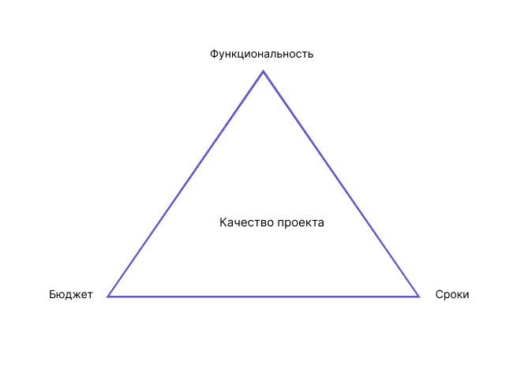
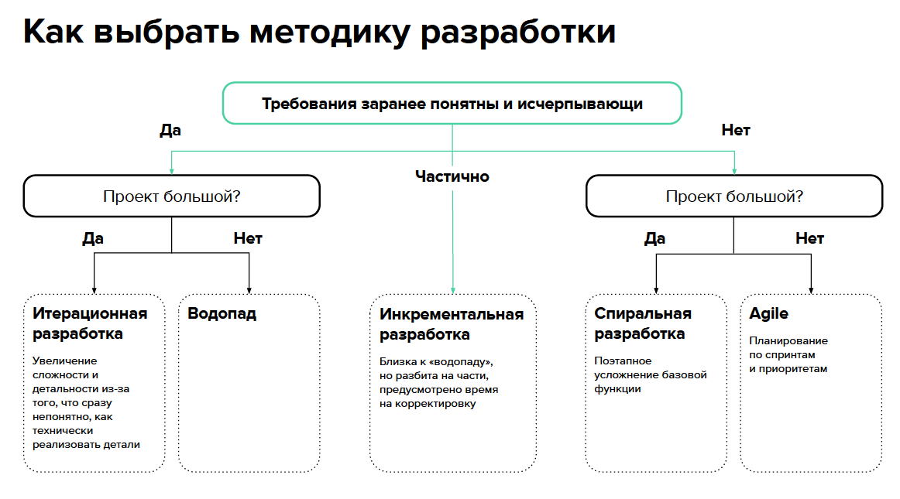
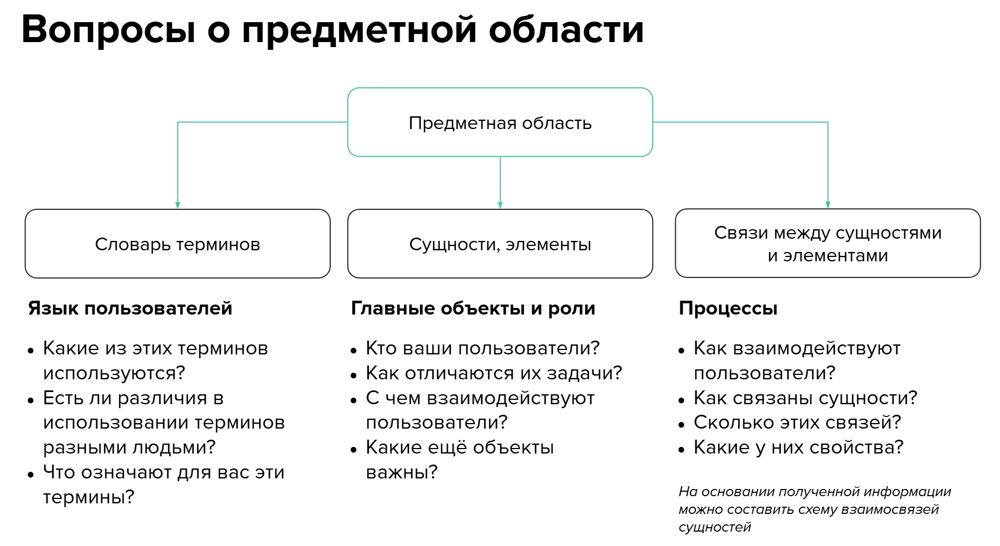
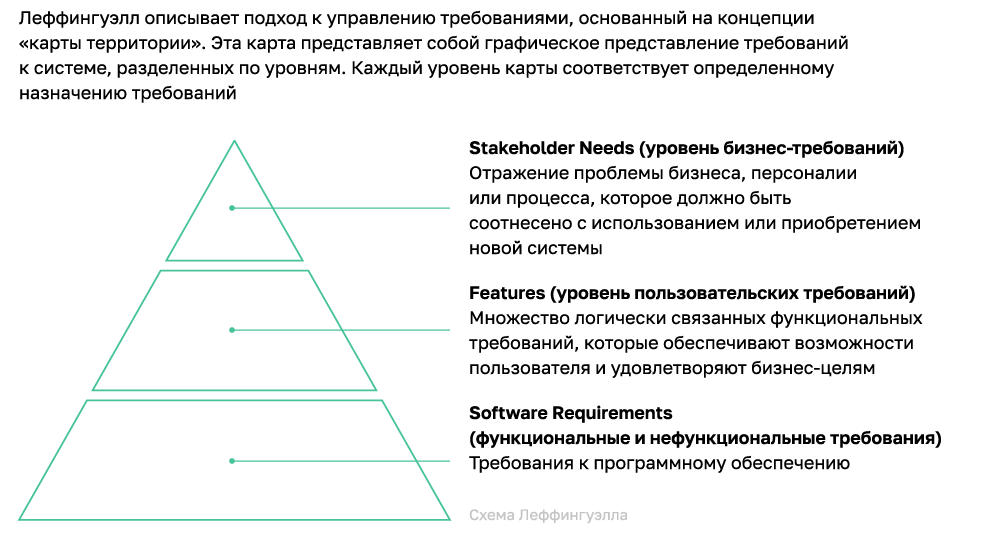
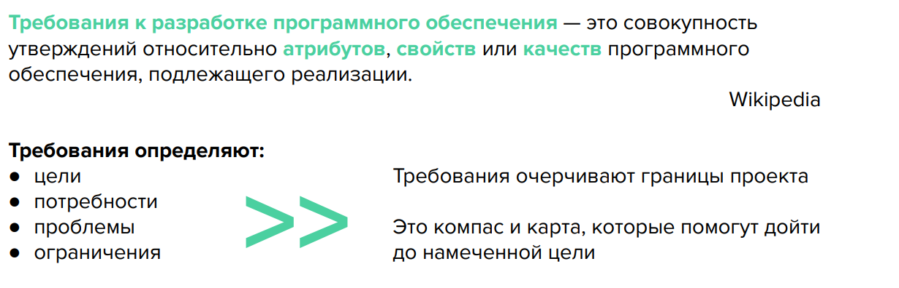
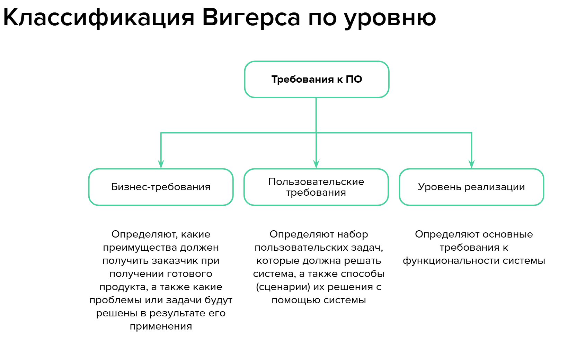
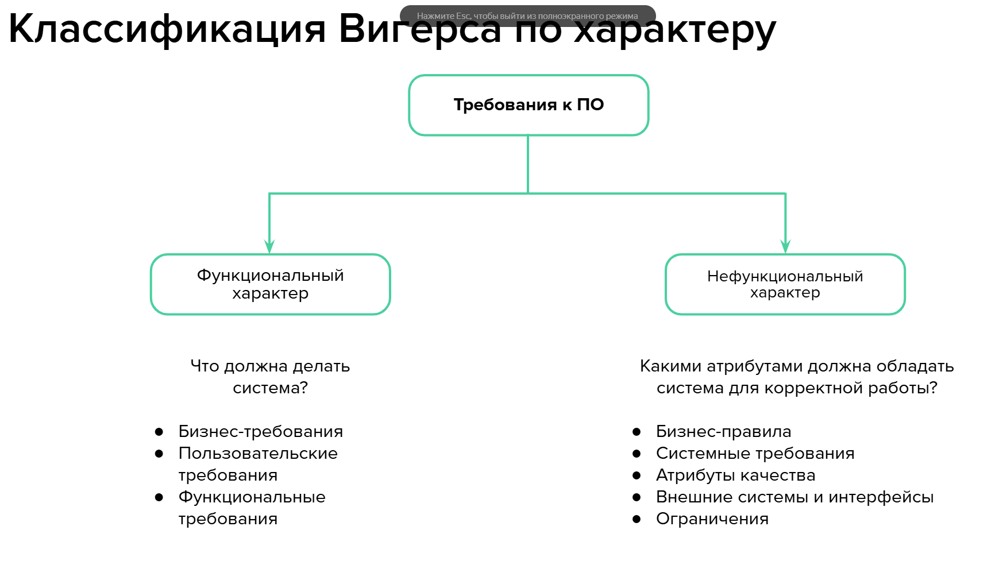
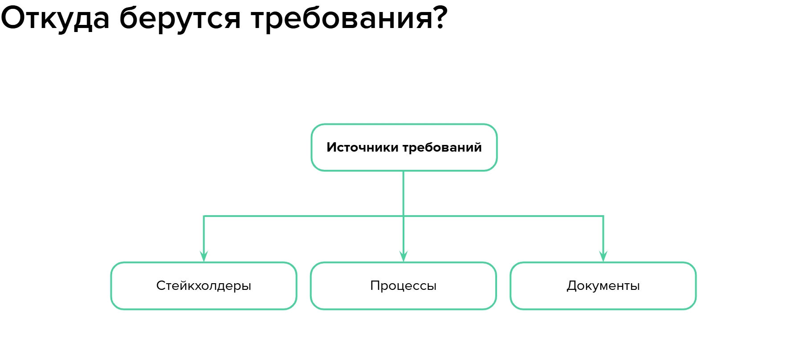
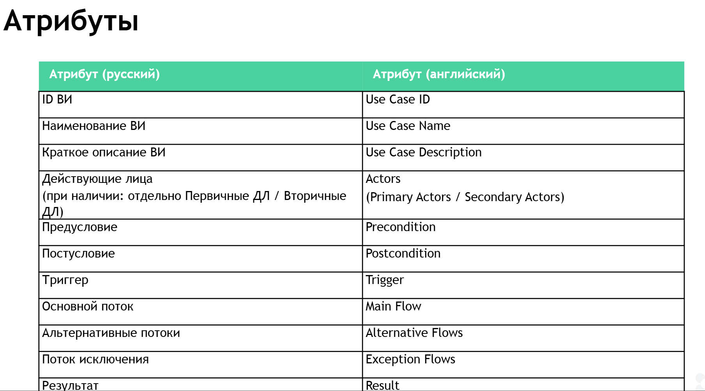

# Подготовка Системного аналитика

## Состав команды разработки
### Роли в команде:
* Владелец продукта (Product owner, product manager)
* Менеджер проекта (Project manager, РП, ПМ)
* Бизнес-аналитик
* Системный аналитик
* Дизайнер пользовательских интерфейсов
* Архитектор
* Разработчик
* Тестировщик (QA-инженер)
* DevOps-инженер
* Сопровождение

## Обязанности участников команды
### Владелец продукта:
* Поддерживает поток идей и ресурсов
* Разрабатывает стратегию развития
* Исследует рынок и анализирует конкурентов
* Участвует в переговорах с клиентами
* Готовит презентации и материалы

### Менеджер проекта:
* Планирует работы
* Контролирует исполнение плана
* Управляет рисками
* Организует коммуникацию

### Бизнес-аналитик:
* Анализирует бизнес-процессы
* Формирует портрет пользователя
* Моделирует бизнес-процессы
* Определяет верхнеуровневые требования

### Системный аналитик:
* Собирает и анализирует требования
* Проектирует взаимодействия
* Документирует решения
* Консультирует команду

### UX/UI-дизайнер:
* Создает дизайн-макеты
* Прорабатывает пользовательские взаимодействия

### Разработчики:
#### Frontend:
* Реализует интерфейсы
* Обеспечивает клиент-серверное взаимодействие

#### Backend:
* Реализует бизнес-логику
* Обеспечивает хранение данных

### Архитектор:
* Определяет архитектурный шаблон
* Разделяет систему на компоненты
* Разрабатывает план масштабирования

### Тестировщик:
* Составляет сценарии тестирования
* Фиксирует и проверяет ошибки

### DevOps-инженер:
* Автоматизирует процессы поставки
* Управляет инфраструктурой

### Отдел сопровождения:
* Обрабатывает обращения пользователей
* Формирует базу знаний

## Жизненный цикл ПО
### Основные этапы:
1. Анализ
2. Проектирование
3. Реализация
4. Тестирование
5. Внедрение
6. Сопровождение

## Коммуникации в команде
### Виды взаимодействий:
1. Планирование (долго-, средне-, краткосрочное)
2. Статус-встречи
3. Ретроспективы
4. Демо и ревью
5. Грумминг

### Форматы статус-встреч:
* По частоте: ежедневные/регулярные
* По способу: онлайн/офлайн
* По охвату: по задаче/по всем задачам
* По участникам: внутри-/межкомандные

## Методологии управления проектами
### Agile:
* Гибкий итеративный подход
* Акцент на работающий продукт
* Готовность к изменениям

### Scrum:
* Работа спринтами (2-4 недели)
* Роли: PO, Scrum Master, команда
* События: планирование, daily, демо, ретро

### Kanban:
* Визуализация потока работ
* Ограничение WIP
* Постоянное улучшение

### Waterfall:
* Последовательные этапы
* Жесткое планирование
* Подходит для проектов с четкими требованиями

## Анализ предметной области
### Шаг 1: Исследование
* Изучение внутренних документов
* Анализ конкурентов
* Определение ключевых метрик

### Шаг 2: Интервьюирование
* Выбор экспертов (руководство, пользователи, сообщество)
* Составление вопросника

## Требования к ПО
### Определение:
* Условия или возможности, необходимые для решения задач
* Атрибуты и свойства разрабатываемой системы

### Классификация:
1. Функциональные (что система делает)
2. Нефункциональные (как система работает)

## Функциональные требования
### Примеры:
* Регистрация пользователей
* Расчет суммы заказа
* Отображение истории транзакций

## Нефункциональные требования
### Категории:
* Производительность
* Безопасность
* Надежность
* Масштабируемость
* Удобство использования
* Совместимость
* Поддерживаемость

## Работа с требованиями
### Процесс:
1. Выделение (извлечение, согласование)
2. Систематизация
3. Валидация
4. Верификация
5. Формализация

### Методы формализации:
* Шаблоны
* Варианты использования
* Алгоритмические модели

## Приоритизация (MoSCoW)
### Категории:
* MUST HAVE - обязательно
* SHOULD HAVE - желательно
* COULD HAVE - возможно
* WON'T HAVE - не сейчас

## Методы сбора требований
### Основные подходы:
1. Интервью
2. Анкетирование
3. Прототипирование
4. Наблюдение
5. Анализ документов

## User Stories
### Формат:
Как <роль>, я хочу <функция>, чтобы <ценность>

### Критерии качества (INVEST):
* Независимая
* Обсуждаемая
* Ценная
* Оцениваемая
* Небольшая
* Тестируемая

## Персоны
### Определение:
Архетип пользователя с характеристиками:
* Демография
* Поведенческие паттерны
* Потребности и боли

### Использование:
* Формирование ролевой модели
* Приоритизация функций
* Улучшение UX

## Варианты использования
### Атрибуты:
1. Акторы
2. Предусловия
3. Основной поток
4. Альтернативные потоки
5. Постусловия

